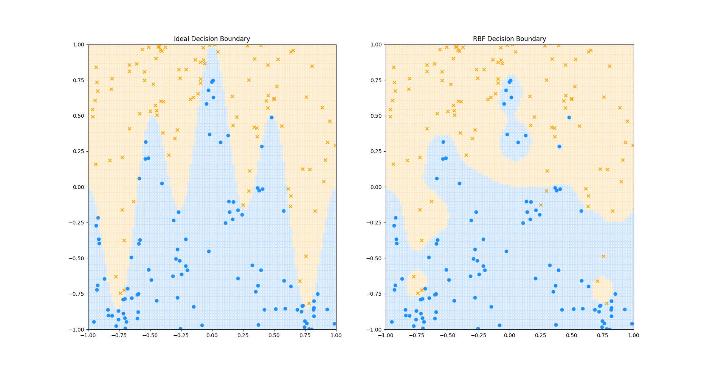

# flax_rbf: Radial Basis Function Layers and Networks implemented in FLAX

[RBF Layers and Networks](https://en.wikipedia.org/wiki/Radial_basis_function_network) implemented in [FLAX](https://flax.readthedocs.io/en/latest/index.html).

## Dependencies
To install, run:
```bash
cd flax_rbf
virtualenv venv
source venv/bin/activate
pip install -r requirements.txt
```

## Examples
See a classification demo in ```flax_rbf/classification.py```.

<p align="center">
  
</p>
